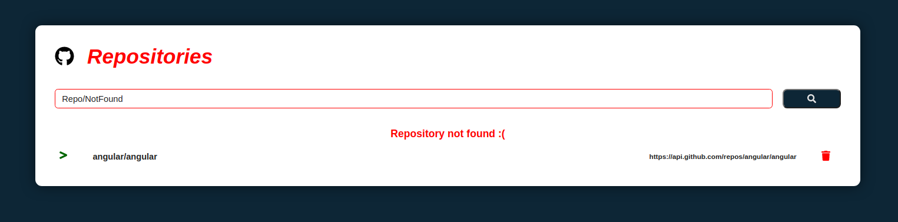

# :earth_americas: Get Repositories From Github Api :earth_americas:

---


---

## :pushpin: Requirements: :pushpin:

ReactJs: :link: https://pt-br.reactjs.org/

NodeJs: :link: https://nodejs.org/en/


---
#### :arrow_forward:   Get Started: 

  1. Clone this repo
   ```sh
   git clone https://github.com/Aleydon/Repositories.git
   ```
  2. Install NPM packages
   ```sh
   npm install or yarn install
   ```
   3. Run this project
   ```sh
   npm start or yarn start
   ```
---  


<h4>:mag: search the repositories:</h4> 


<h5>:exclamation:Returns an error message if the repository is not found.</h5>



